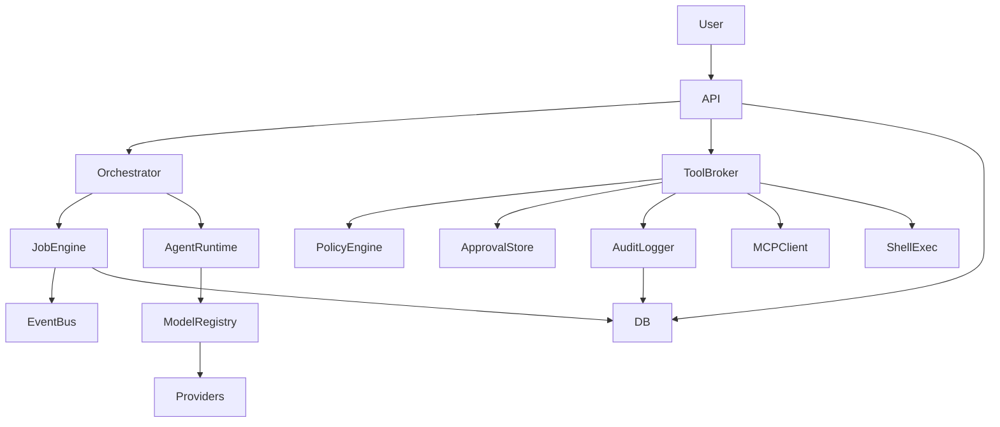

# OverMind Architecture (Current State)

## Component Map
- `app/main.py` bootstraps FastAPI, routing, and shared services.
- `app/core/orchestrator.py` coordinates runs and delegates to the job engine.
- `app/core/job_engine.py` persists job state and executes step handlers.
- `app/agents/runtime.py` builds prompts and calls model providers.
- `app/integrations/mcp_client.py` discovers MCP endpoints and tools.
- `app/core/tool_broker.py` mediates tool requests and policy checks.
- `app/core/policy.py` enforces risk, scope, and approval requirements.
- `app/core/audit.py` logs tool requests and results.
- `app/core/secrets.py` brokers capability tokens for provider keys.
- `app/core/approvals.py` stores approvals for high-risk actions.
- `app/db/models.py` defines SQLModel tables for runs, jobs, and audit logs.

## Current Data Flow (Simplified)

## Known Gaps (pre-Phase 2/3)
- Integrations are MCP discovery only; connectors are stubbed.
- Verification is currently no-op; test execution and artifact checks are pending.
- Secrets broker issues capability tokens but providers still use env keys.

## Team Commands
- `@break`: pauses all agent work for the active run.
- `@attention`: pauses work and calls a team meeting.
- `@resume`: resumes work (any stakeholder message also resumes).